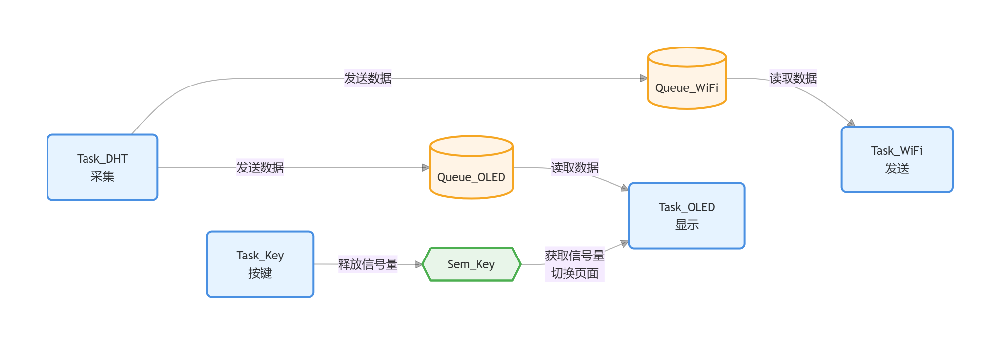
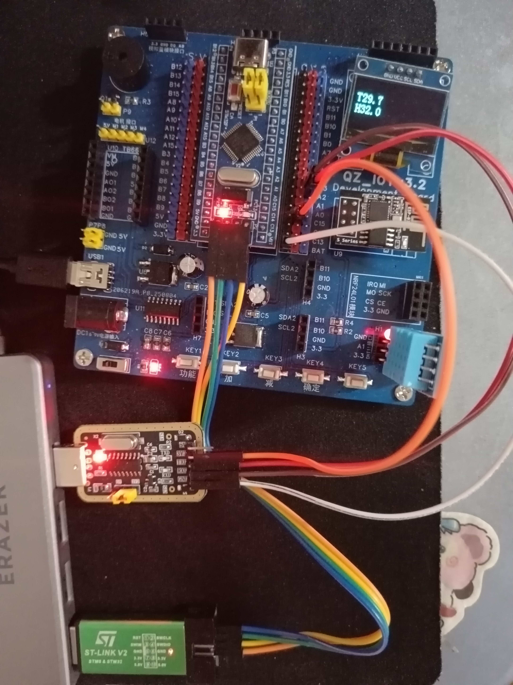
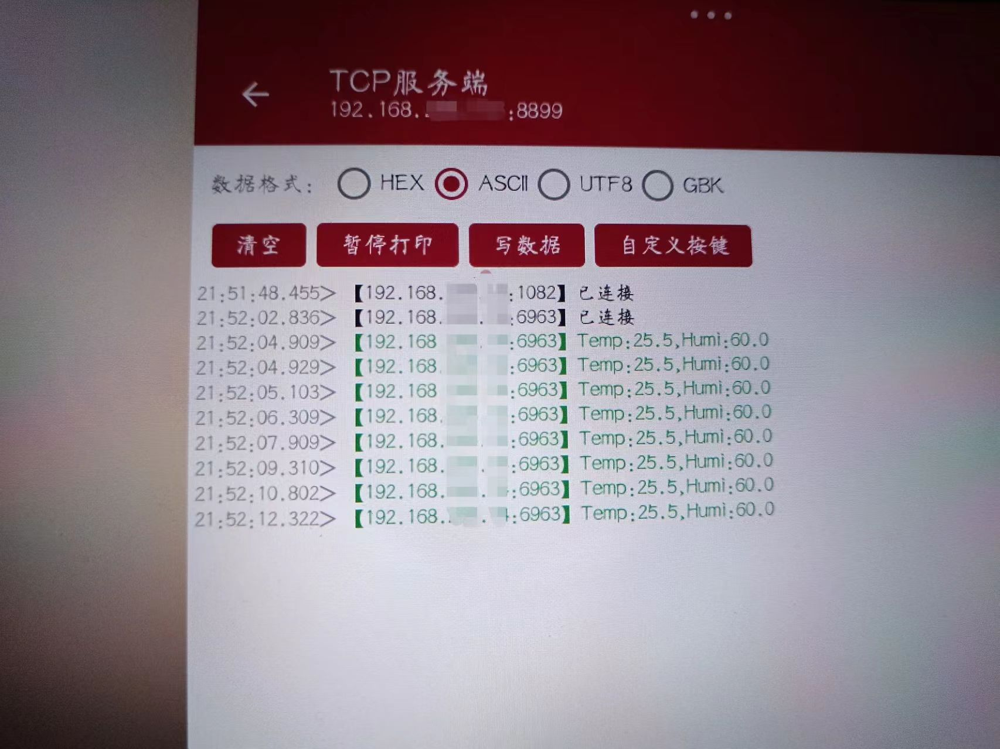

# 基于 STM32F103C8T6 与 FreeRTOS 的物联网温湿度监测系统（含看门狗与低功耗优化）

## 项目简介

本项目基于 **STM32F103C8T6** 微控制器与 **FreeRTOS** 实时操作系统，构建了多任务物联网温湿度监测系统。系统通过 DHT11 采集环境温湿度，在 0.96 寸 OLED 屏幕上实时显示，并利用 ESP8266 模块通过 TCP 协议将数据上传至云端/手机网络调试助手。

在基础功能之外，项目实现了任务级心跳监控、独立硬件看门狗（IWDG）与深度低功耗（STOP 模式）设计。系统支持短按翻页与长按休眠，并具备 TCP 断线自动重连机制。

## 核心技术与环境

| 项目 | 说明 |
| :--- | :--- |
| **硬件平台** | STM32F103C8T6 (Blue Pill) |
| **开发环境** | STM32CubeMX + Keil MDK5 |
| **实时操作系统** | FreeRTOS (CMSIS-RTOS v2) |
| **通信协议** | TCP/IP、I2C、单总线 (One-Wire) |
| **外设模块** | DHT11、0.96寸 OLED、ESP8266、物理按键、板载LED、IWDG |

## 系统架构设计

## 多任务架构与业务逻辑

采用 FreeRTOS 将功能拆分为独立任务：按键扫描、DHT11 数据采集、OLED 显示、WiFi 发送、状态 LED、看门狗监控。任务间通过消息队列传递数据、信号量通知事件。

- **Task_Key（按键任务）**：轮询检测按键，实现短按/长按逻辑分离。按下时间 `< 2s` 释放信号量触发翻页；按住 `≥ 2s` 调用 `Enter_StopMode()` 进入低功耗，并包含松手检测与防抖。
- **Task_DHT（采集任务）**：每 1.5 秒采集一次温湿度，经临界区保护后同时分发至 OLED 与 WiFi 消息队列。
- **Task_OLED（显示任务）**：根据按键信号量切换页面，非阻塞读取队列数据，更新屏幕显示。
- **Task_WiFi（通信任务）**：阻塞等待队列数据，通过 AT 指令发送 TCP 数据包；发送失败时自动执行 `AT+CIPCLOSE → AT+CIPSTART` 重连。
- **Task_LED（指示灯任务）**：依据 WiFi/DHT 错误计数，用不同闪烁频率提供直观的故障可视化。
- **Task_WatchDog（监控任务）**：DHT/OLED/Key 任务各自维护心跳变量。监控任务每 500ms 检查，只有全部心跳正常才刷新 IWDG；任一任务卡死则停止喂狗，触发硬件复位。

---

## 核心亮点：深度低功耗（STOP 模式）设计

### 1. 完整的状态保存与恢复流程
在 `Enter_StopMode()` 中实现了严格的休眠流程：
1. 清理挂起的中断标志，清除唤醒标志。
2. 挂起调度器（`vTaskSuspendAll`）。
3. 暂停 SysTick（`HAL_SuspendTick`），避免其干扰 WFI。
4. 进入前刷新 IWDG，然后调用 `HAL_PWR_EnterSTOPMode` 进入 STOP。

唤醒后严格按序恢复：
> 喂狗 → 恢复系统时钟（`SystemClock_Config`）→ 恢复 Tick（`HAL_ResumeTick`）→ 恢复调度器（`xTaskResumeAll`）→ 重新初始化 OLED 并显示“WOKEN UP!”反馈。

### 2. 看门狗与低功耗的平衡（关键约束）
IWDG 由 LSI 驱动，在 STOP 模式下仍然继续计数（实测约 6.5s 超时，睡眠上限约 8s）。这是 STM32F1 的硬件特性，软件无法关闭 IWDG。
因此，本项目采用：
- 进入 STOP 前刷新 IWDG，获得最大睡眠余量；
- 唤醒后第一时间喂狗，再执行时钟与调度恢复；
- 单次睡眠时间控制在 IWDG 超时以内，确保常规休眠场景不会被复位。若出现异常导致唤醒晚于超时，IWDG 会强制复位系统，使设备恢复运行——这是看门狗的保护机制之一
若需无限时长休眠，必须在 CubeMX 中禁用 IWDG，或改用 RTC 定时唤醒 + 外部事件唤醒。项目中对此取舍做了详细记录，以理解低功耗与系统可靠性的工程边界。

---

## 调试过程中踩坑与修复

**问题一：FreeRTOS 环境下 DHT11 一直读取失败**
- **排查**：微秒级延时误用 `HAL_Delay()`（基于 SysTick，会被 RTOS 调度影响），导致单总线时序被破坏。
- **解决**：改用关中断 + 空转延时，并在读取期间用 `taskENTER_CRITICAL()/taskEXIT_CRITICAL()` 保护时序。修复后稳定读取。

**问题二：ESP8266 发送卡死或数据丢失**
- **排查**：模块曾误入 AT 透传模式（`AT+CIPMODE=1`），后续 AT 指令被当作数据发送。
- **解决**：初始化强制 `AT+CIPMODE=0`，发送前等待 `>` 返回，并实现失败自动重连 TCP。

**问题三：按键切换 OLED 页面出现乱码**
- **排查**：`sprintf` 浮点数格式化时栈空间不足，导致内存溢出。
- **解决**：OLED 任务 Stack Size 从 128 字增大至 **512 字**。

**问题四：低功耗时系统自动复位（最具价值）**
- **现象**：进入 STOP 后约 2 秒“自动恢复”，看起来像是正常退出。
- **排查**：通过打印复位标志寄存器，定位为 `PINRST`（NRST 引脚复位），并非软件唤醒。
- **根因**：ST-Link 调试器在低功耗切换瞬间对 NRST 引脚产生电气干扰，导致硬件复位。
- **解决**：确立“拔掉调试器，断开地线，仅用独立电源供电测试”的标准流程。排除后唤醒功能完全正常。

**问题五：IWDG 导致低功耗 8 秒后复位**
- **现象**：断开 ST-Link 后，STOP 模式约 8 秒后系统重启。
- **排查**：打印复位标志确认为 IWDG 复位。查阅参考手册确认：**IWDG 在 STOP 模式下不会停止计数**。
- **解决**：唤醒后第一时间喂狗，并将单次睡眠时间限制在 IWDG 超时范围内（实测约 6.5s）。若需更长时间休眠，则需禁用 IWDG 或采用 RTC 唤醒。

**调试策略**：采用**模块化剥离排错法**，将任务替换为空壳逐个启用，快速区分系统调度问题与外设驱动问题。使用复位标志打印（RCC_FLAG_*）区分复位源，是本次调试效率提升的关键。

---

## 硬件接口说明

| 外设 | 引脚 | 备注 |
| :--- | :--- | :--- |
| DHT11 | PA1 | 需内部上拉 |
| ESP8266 | PA2(TX), PA3(RX) | USART2, 波特率 115200 |
| OLED 屏幕 | PB8(SCL), PB9(SDA) | I2C |
| 板载 LED | PC13 | 推挽输出 |
| 按键 | PA11 | 内部上拉，下降沿触发 |

**电源警告**：请根据具体 ESP8266 模块手册确认供电电压：裸模块（如 ESP-01）必须 3.3V 供电，禁止直接接 5V；带板载稳压的开发板可接 5V 输入

*硬件实物连接及 OLED 实时显示*

*平板 TCP 服务端接收到的温湿度数据流*

---

## 项目总结与反思

本项目不仅是外设驱动的简单堆叠，更涉及 FreeRTOS 多任务资源管理、临界区保护、任务间通信、低功耗状态机设计与硬件看门狗约束权衡等嵌入式核心问题。

其中最有价值的经验是：**低功耗设计绝不仅是调用一个 HAL 库函数，而是软件状态、硬件外设行为与调试工具三者共同作用的结果：

1. 先用复位标志区分“唤醒”与“复位”；
2. 再用 GPIO 探针确认唤醒路径是否打通；
3. 最后排除调试器硬件干扰；
4. 最终理解并接受了 IWDG 在 STOP 下的硬件限制，并调整了睡眠策略。

这一过程沉淀的经验可直接复用到后续其他低功耗产品的开发中。

**后续优化方向：**
- 引入 RTC 定时唤醒 + 外部中断唤醒，实现更长待机周期；
- 增加 Flash 存储，实现离线数据补传；
- 引入更多传感器（如光照/气压），扩展系统能力；
- 设计低功耗 PCB，测量整板功耗曲线并优化。