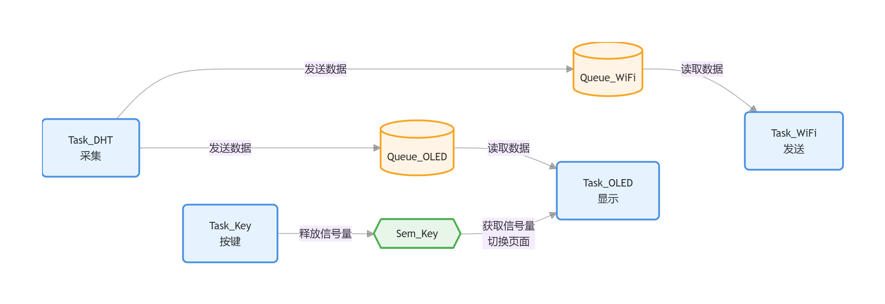
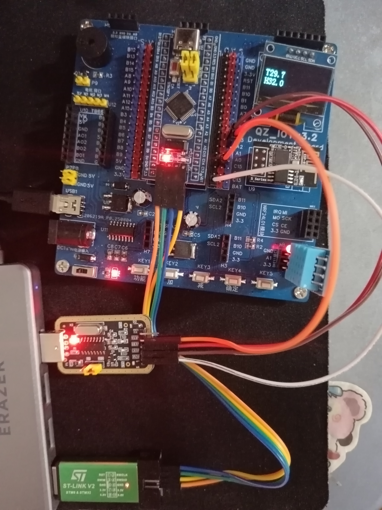
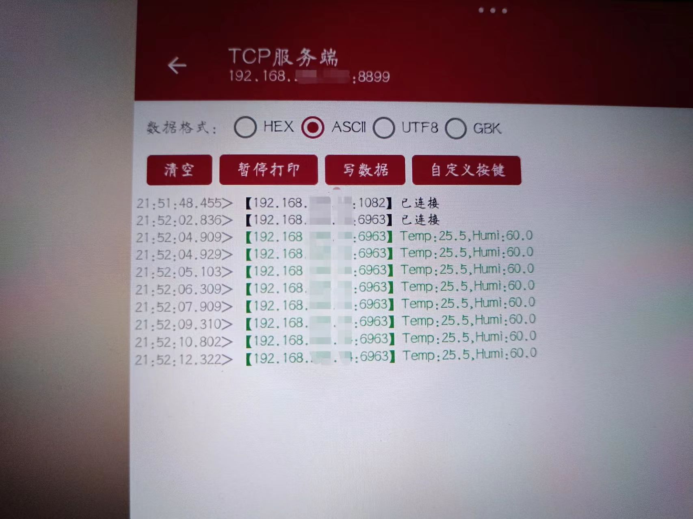

# 基于 STM32F103C8T6 与 FreeRTOS 的物联网温湿度监测系统（含看门狗与低功耗优化）

## 项目简介

本项目基于 **STM32F103C8T6** 微控制器与 **FreeRTOS** 实时操作系统，构建了多任务物联网温湿度监测系统。系统通过 DHT11 采集环境温湿度，在 0.96 寸 OLED 屏幕上实时显示，并利用 ESP8266 模块通过 TCP 协议将数据上传至云端/手机网络调试助手。

在基础功能之外，项目实现了任务级心跳监控、独立硬件看门狗（IWDG）与深度低功耗（STOP 模式）设计。系统支持短按翻页与长按休眠，并具备 TCP 断线自动重连机制。

## 核心技术与环境

| 项目 | 说明 |
| :--- | :--- |
| **硬件平台** | STM32F103C8T6 (Blue Pill) |
| **开发环境** | STM32CubeMX + Keil MDK5 |
| **实时操作系统** | FreeRTOS (CMSIS-RTOS v2) |
| **通信协议** | TCP/IP、I2C、单总线 (One-Wire) |
| **外设模块** | DHT11、0.96寸 OLED、ESP8266、物理按键、板载LED、IWDG |

## 系统架构设计

## 多任务架构与业务逻辑

采用 FreeRTOS 将功能拆分为独立任务：按键扫描、DHT11 数据采集、OLED 显示、WiFi 发送、状态 LED、看门狗监控。任务间通过消息队列传递数据、信号量通知事件。

- **Task_Key（按键任务）**：轮询检测按键，实现短按/长按逻辑分离。按下时间 `< 2s` 释放信号量触发翻页；按住 `≥ 2s` 调用 `Enter_StopMode()` 进入低功耗，并包含松手检测与防抖。
- **Task_DHT（采集任务）**：优先级最高。每 1.5 秒采集一次温湿度，同时分发至 OLED 与 WiFi 消息队列。其他任务抢占不了它；单总线只在应答和判位时关中断。
- **Task_OLED（显示任务）**：根据按键信号量切换页面，非阻塞读取队列数据，更新屏幕显示。第二页是 Wi-Fi / DHT / 入网失败计数。
- **Task_WiFi（通信任务）**：USART2 中断把 AT 应答写入环形缓冲。状态机区分未入网、TCP 断开和发送失败；收到 `SEND OK` 才算发送成功。账号密码在 `user/wifi_config.h`。
- **Task_LED（指示灯任务）**：Wi-Fi 发送或入网连续失败时快闪，DHT 连续失败时慢闪。
- **Task_WatchDog（监控任务）**：优先级高于通信任务。采集、显示、按键、通信各自维护心跳。每 500ms 检查，四路都在 5 秒内才刷新 IWDG。每 10 秒打印各任务栈高水位。

---

## 核心亮点：深度低功耗（STOP 模式）设计

### 1. 时钟与唤醒
`HAL_SuspendTick()` 关的是 TIM4（HAL 时基），FreeRTOS 节拍在 SysTick 上。进入 STOP 前两路都关掉，并清掉已经挂起的中断，避免 `WFI` 立刻返回。STOP 期间 HCLK 停止，SysTick 不会再每 1 ms 叫醒 CPU。

唤醒后先喂狗，再 `SystemClock_Config()` 把时钟从 HSI 拉回 PLL，然后打开 SysTick 和 TIM4。按键 EXTI 才退出休眠；RTC 闹钟醒来只是喂狗后再次进入 STOP。

休眠前关闭 OLED（`0xAE`），并把 ESP8266 EN（PB0）拉低，同时关掉 USART2 中断，避免 RX 脚噪声把 STOP 叫醒。唤醒后拉高 EN，通信任务重新从 `AT` 入网。

### 2. 看门狗与 RTC 切片
IWDG 由 LSI 驱动，STOP 下继续计数，软件关不掉。预分频 64、重载 4095 时，超时 = `4096 * 64 / f_LSI`。LSI 按标称 40 kHz 约 6.5 s；LSI 最快约 60 kHz 时最短约 4.4 s。

RTC 与 IWDG 都用 LSI，所以比的是周期数，而不是各自换算出来的秒：

- 闹钟 3 s：`3 * 40000 = 120000` 个 LSI 周期
- 看门狗窗口：`4096 * 64 = 262144` 个 LSI 周期

闹钟先到。每次 RTC 唤醒只喂狗并继续睡，按键才回到业务。上电读取 `RCC->CSR`，区分 IWDG、上电复位和 NRST 引脚复位，然后写 `RMVF`。调试器附着时 `DBGMCU` 会冻结 IWDG，这段行为要拔掉 ST-Link、用独立电源测。

---

## 调试过程中踩坑与修复

**问题一：FreeRTOS 环境下 DHT11 一直读取失败**
- **排查**：采集任务已经是最高业务优先级，其他任务抢占不了它。失败来自 SysTick、TIM4、USART 中断打断了微秒级空转延时。`HAL_Delay()` 也不能用，它依赖时基中断。
- **解决**：18 ms 起始信号不关中断。只在传感器应答和读取 40 位期间 `taskENTER_CRITICAL()`。整帧关中断大约会挡住 20 ms，串口会丢字节。

**问题二：ESP8266 发送卡死或数据丢失**
- **排查**：模块曾误入 AT 透传模式（`AT+CIPMODE=1`）。只等到 `>` 就认为发送成功，没有核对 `SEND OK`，Wi-Fi 掉线和 TCP 断开也混在一次重连里。
- **解决**：USART2 接收中断写入环形缓冲。入网失败回到 `CWJAP`，只出现 `CLOSED` 时重开 TCP，发送必须等到 `SEND OK`。等待应答时刷新通信任务心跳，避免入网的十几秒被看门狗复位。

**问题三：按键切换 OLED 页面出现乱码**
- **排查**：`snprintf` 浮点格式化时显示任务栈溢出。
- **解决**：OLED 任务栈为 256 word（`stack_size = 256 * 4` 字节）。`configCHECK_FOR_STACK_OVERFLOW = 2`，钩子经 USART1 打印任务名并闪灯。看门狗任务每 10 秒打印高水位（`HW DHT=...`）。

**问题四：低功耗时系统自动复位（最具价值）**
- **现象**：进入 STOP 后约 2 秒“自动恢复”，看起来像是正常退出。
- **排查**：通过打印复位标志寄存器，定位为 `PINRST`（NRST 引脚复位），并非软件唤醒。
- **根因**：ST-Link 调试器在低功耗切换瞬间对 NRST 引脚产生电气干扰，导致硬件复位。
- **解决**：确立“拔掉调试器，断开地线，仅用独立电源供电测试”的标准流程。排除后唤醒功能完全正常。

**问题五：IWDG 导致低功耗约 6 秒后复位**
- **现象**：断开 ST-Link 后，STOP 模式大约数秒后系统重启。
- **排查**：复位标志为 IWDG。参考手册写明 IWDG 在 STOP 下继续计数，时钟是 LSI，不能用 40 kHz 的标称值当成最短超时。
- **解决**：RTC 闹钟每 3 秒唤醒，喂狗后若按键没有按下就再次 STOP。按键 EXTI 才真正退出。唤醒后的第一件事仍然是喂狗，然后再恢复 PLL。

**调试策略**：采用**模块化剥离排错法**，将任务替换为空壳逐个启用，快速区分系统调度问题与外设驱动问题。使用复位标志打印（RCC_FLAG_*）区分复位源，是本次调试效率提升的关键。

---

## 硬件接口说明

| 外设 | 引脚 | 备注 |
| :--- | :--- | :--- |
| DHT11 | PA1 | 需内部上拉 |
| ESP8266 | PA2(TX), PA3(RX), PB0(EN) | USART2，115200。PB0 接 CH_PD/EN，高电平工作 |
| OLED 屏幕 | PB8(SCL), PB9(SDA) | I2C |
| 板载 LED | PC13 | 推挽输出 |
| 按键 | PA11 | 内部上拉，下降沿触发 |

**电源警告**：请根据具体 ESP8266 模块手册确认供电电压：裸模块（如 ESP-01）必须 3.3V 供电，禁止直接接 5V；带板载稳压的开发板可接 5V 输入

*硬件实物连接及 OLED 实时显示*

*平板 TCP 服务端接收到的温湿度数据流*

---

## 项目总结与反思

本项目不仅是外设驱动的简单堆叠，更涉及 FreeRTOS 多任务资源管理、临界区保护、任务间通信、低功耗状态机设计与硬件看门狗约束权衡等嵌入式核心问题。

其中最有价值的经验是：**低功耗设计绝不仅是调用一个 HAL 库函数，而是软件状态、硬件外设行为与调试工具三者共同作用的结果：

1. 先用复位标志区分“唤醒”与“复位”；
2. 再用 GPIO 探针确认唤醒路径是否打通；
3. 最后排除调试器硬件干扰；
4. 最终理解并接受了 IWDG 在 STOP 下的硬件限制，并调整了睡眠策略。

这一过程沉淀的经验可直接复用到后续其他低功耗产品的开发中。

**使用前**
- 在 `user/wifi_config.h` 填写热点和 TCP 服务端。
- 把 ESP8266 的 EN/CH_PD 接到 PB0。模块若已把 CH_PD 焊在 3.3V 上，可以不接 PB0，休眠时模块不会掉电，唤醒后仍会重新入网。
- 低功耗电流和 IWDG 行为要拔掉 ST-Link，用独立电源测。串口上电会打印 `RST IWDG` / `RST PIN` / `RST POR`。

**还没做的测量**
- 运行电流、STOP 且模块仍供电、STOP 且 ESP8266 与屏幕都关掉，这三组电流需要万用表串在 3.3 V 上测完再写进简历。